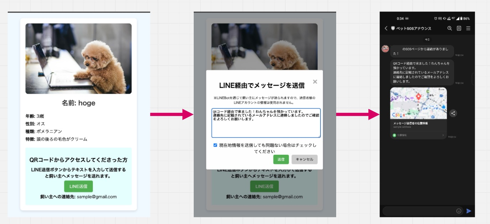

# 【レイアウト開発中】ペットSOSページ

## 概要
ペットSOSページは、迷子になったペットを見つけるための支援を行うウェブアプリケーションです。ユーザーはペットの情報を登録、ページURLのQRコードのキーホルダー等を作成し、ペットに身につけることで万が一迷子になられても保護してくれた方から連絡を取ることができます。
ペットを保護した方はQRコードからSOSページに遷移をし、LINE送信ボタンからメッセージを送信すると飼い主宛にLINEメッセージが届きます。

## 特徴
- **ペット情報の登録**: ペットの名前、種類、特徴、写真などを表示できます。
- **位置情報の共有**: 保護してくれた方がメッセージを送信してくれた場所の情報を共有することができます。

## 技術
### 選定

[](https://skillicons.dev)

## インストール
以下の手順でプロジェクトをローカル環境にインストールします。

1. リポジトリをクローンします。
    ```bash
    git clone https://github.com/yourusername/pet-sos.git
    ```
2. プロジェクトディレクトリに移動します。
    ```bash
    cd pet-sos
    ```
3. 必要な依存関係をインストールします。
    ```bash
    npm install
    ```

## 使用方法
### 環境変数
今アプリケーションでは２種類の環境変数を使用しています。
- PET_SOS_CHANNEL_TOKEN:LINEMessageAPIのアクセストークン
- SEND_LINE_TARGET_USERID:宛先のUID
### 起動方法
開発サーバーを起動し、アプリケーションをローカルで確認します。
```bash
npm run dev
```
